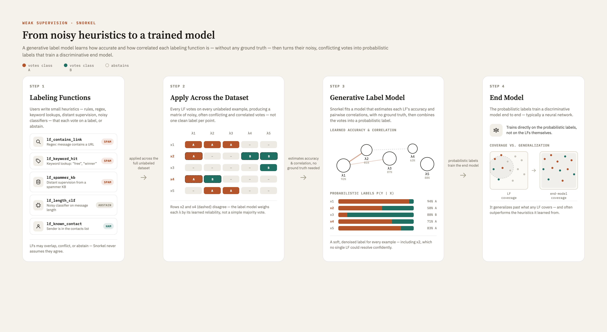

## Key Findings

- State-of-the-art models require large amounts of labeled data, and labeling guidelines/granularities/downstream use cases often change, forcing costly re-labeling — weak supervision addresses this by training on data labeled through external knowledge bases, rules/patterns, or other classifiers instead of manual annotation ("programmatic training data").
- General weak supervision pipeline: many noisy "votes" on each example → one aggregation step estimates their accuracies → a single soft (probabilistic) label per example → an end model is trained on those soft labels.
- Snorkel's specific approach: (1) users write labeling functions (LFs) — heuristics, regex/pattern matching, rules of thumb, negative-label generators, etc. — that each label a subset of the unlabeled data; (2) a generative model learns each LF's accuracy and combines their outputs into a probabilistic label (e.g., 0.90, 0.65) by estimating P(L | y), where L is the LFs' outputs and y is the unknown true label; (3) a DNN is trained on the raw data using these probabilistic labels as targets.
- A broader definition treats "weak" supervision as anything short of fully accurate ("strong") supervision, and splits it into three types:
    - **Incomplete** — only a subset of data is labeled. Addressed via **active learning** (a human iteratively labels the examples the model is most uncertain about) or **semi-supervised learning** (the model generates its own high-confidence pseudo-labels on unlabeled data and retrains without further human input, using generative, graph-based, low-density separation, or disagreement-based/co-training methods).
    - **Inexact** — labels exist but are coarse-grained (e.g., one label for an image with multiple subjects, or one label for a box of many items).
    - **Inaccurate** — labels exist but aren't always correct, arising from noisy labels or crowdsourcing (many workers of unknown/varying reliability).
- Labeling functions themselves can be produced automatically, interactively (human + model collaboration), or through guided generation, rather than only being hand-written.

## Diagram

## Current Best Approaches (Benchmarks)

- **WRENCH** is the main benchmark for comprehensively evaluating weak supervision methods.
- **Snorkel** is the primary/most established general-purpose weak supervision framework (LF authoring + generative label model + end-model training).
- **Skweak** adapts the weak supervision paradigm specifically to named entity recognition (NER).
- **Cleanlab** is a current tool focused on finding and correcting label errors (relevant to the "inaccurate" weak supervision case).
- **Knodle** is another current weak supervision framework (companion paper available).
- **ANEA** is another current tool in this space; not yet detailed further in notes.

## Recent Advancements

- **Snorkel** — the foundational, most widely-used framework for programmatic weak supervision.
- **Skweak** — extends weak supervision methodology to NER-specific extraction tasks.
- **Language Models in the Loop: Incorporating Prompting into Weak Supervision** — incorporates LLM prompting directly into the weak supervision labeling process.
- **Alfred** — a more recent weak-supervision method/tool; not yet detailed further in notes.
- **Snuba** — automates the generation of labeling functions instead of requiring users to hand-write them.
- **Weakly Supervised Named Entity Tagging with Learnable Logical Rules** — automatically learns logical labeling rules for NER.
- **GLaRA** — uses a graph-based approach to automatically augment/expand labeling rules for weakly supervised NER.
- **DARWIN** — adaptively discovers labeling rules through an interactive process with the user.
- **Interactive Weak Supervision: Learning Useful Heuristics for Data Labeling** — an interactive framework where model and human jointly surface useful heuristics/LFs.
- **Interactive Programmatic Labeling for Weak Supervision** — a guided-generation approach that helps users write effective labeling functions interactively.